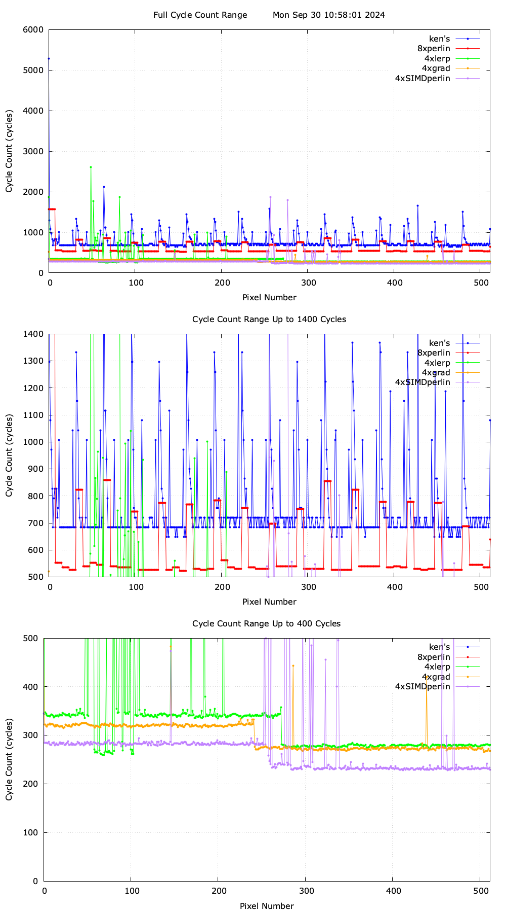

# perlin_noise

perlin noise implemented in cpp, made to be compiled to wasm and used in js

a case-study based on the following articles

https://www.scratchapixel.com/lessons/procedural-generation-virtual-worlds/perlin-noise-part-2/perlin-noise.html

https://www.scratchapixel.com/lessons/procedural-generation-virtual-worlds/procedural-patterns-noise-part-1/introduction.html

https://mrl.cs.nyu.edu/~perlin/noise/

https://scallywag.software/vim/blog/simd-perlin-noise-i

# results

60 fps 1000x1000 px perlin noise animation

# misc commands

emcc worker2.cpp -g -O3 -msimd128 -o ../../temp/workerWasm.js     -s MODULARIZE=1     -s EXPORT_NAME='createModule'     -s USE_PTHREADS=1     -s PTHREAD_POOL_SIZE=0     -s  WASM_MEM_MAX=512MB     --bind

emcc perlin.cpp -O3 -msimd128 -o ../../temp/perlinWasm.js \
  -s EXPORTED_FUNCTIONS="['_generateNoise', '_my_malloc', '_my_free']" \
  -s EXPORTED_RUNTIME_METHODS="['cwrap', 'ccall']" \
  -s MODULARIZE=1 \
  -s EXPORT_NAME='createModule'

perf stat -d ../../temp/./worker 1000 1000 300 1 123123

add cpuid

sudo cpupower frequency-set --governor performance

taskset -c 0 ./scripts/wasm/worker2

g++ scripts/wasm/worker2.cpp -msse4.1 -o scripts/wasm/worker2

clang++ scripts/wasm/worker2.cpp -o scripts/wasm/worker2

sudo taskset -c 0 perf record -e cycles,instructions,cache-references,cache-misses,branches,branch-misses ./scripts/wasm/worker2

sudo perf report

lldb ./scripts/wasm/worker2

gdb ./scripts/wasm/worker2

ffmpeg -i noise.mov -vf "fps=30,scale=1000:-1:flags=lanczos" -c:v gif noise.gif